# NPB 

[Towards Data-Agnostic Pruning At Initialization: What Makes a Good Sparse Mask?](https://openreview.net/pdf?id=xdOoCWCYaY)

不依赖于数据的前瞻剪枝：什么成就一个好的 mask。

---

## 摘要

前瞻剪枝算法再精确度和计算开销减少方面，相比于训练后剪枝还远达不到满意的效果。

作者提出总网络的拓扑结构这一视角来研究前瞻剪枝，用有效路径和有效节点的数量来衡量算法的表现。

进一步地，作者提出一种通过解多目标优化问题逐层剪枝的算法，它能够很好地平衡有效路径和有效节点的数量，实现更好的表现。

---

## 1 Introduction

许多前瞻剪枝算法通过梯度信息来评估网络参数的重要性。

一个惊人的发现是：对于前瞻剪枝算法，逐层地随机打乱剪枝后的网络，不会降低网络的表现。这意味着逐层的稀疏度或许比基于权重的重要性分数更重要。

作者发现上述发现在极高的稀疏度（>99%）下不成立，这是因为随机打乱到导致了有效路径的大量减少。

随机打乱往往会导致更多的有效节点数和更少的有效路径数，在一般的稀疏度下，这不会造成太大影响，甚至有助于提高网络的表现。
但在极高的稀疏度下，随机打乱减少了大量的有效路径，而有效节点数量却与打乱前近似。

作者使用 NAS 论证了路径数量越多，有效节点数量越多，网络表现越好，并提出从网络拓扑视角分析算法等：

1. 从有效路径数量和有效节点数量的视角来理解前瞻剪枝算法的表现。
2. 平衡有效路径数量和有效节点数量的算法往往具有更好的表现。
3. 基于上述结论提出 NPB 算法。

---

## 2. 相关工作

SynFlow 保留路径避免层坍缩，往往导致较窄的层

Path Kernel 从路径视角分析网络输出

PHEW random walk 激活更多节点

---

## 3.方法

### 3.1 前瞻剪枝算法

ER 使用随机拓扑，使较大的层(MLP)具有更高的稀疏度。ERK 是它的卷积版本，根据层中神经元/通道的数量按比例缩放卷积层的稀疏度。

### 3.2 指标定义

有效路径：从一个输入节点到一个输出节点的完整连接，中间没有断开的连接。

有效节点/通道：至少被一条有效路径穿过。

### 3.3 逐层打乱现象

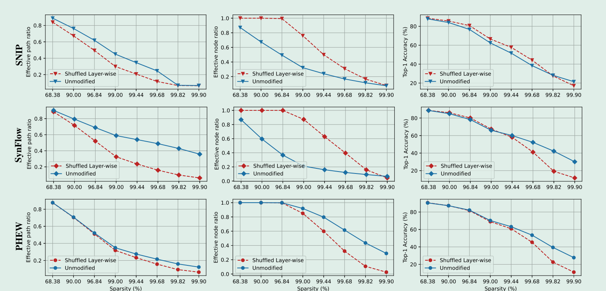

作者使用有效路径数量和有效节点数量来解释为什么随机打乱已剪枝的网络会出现之前所述的现象以及什么时候失效。

可以看到 SNIP 和 SynFlow 在随机打乱后，有效路径数量减少了，但是有效节点数增多，这会导致更宽的网络。

而 PHEW 通过 random walk 已经获得了足够宽的网络，因此随机打乱会同时减少有效路径和有效节点。

稀疏度低于 99% 时，逐层随机打乱可以表现出与原网络相当的性能。然而，在更高的稀疏度下，由于有效路径减少过多，即使网络变得更宽，表现依旧会下降。

### 3.4 NAS 发现

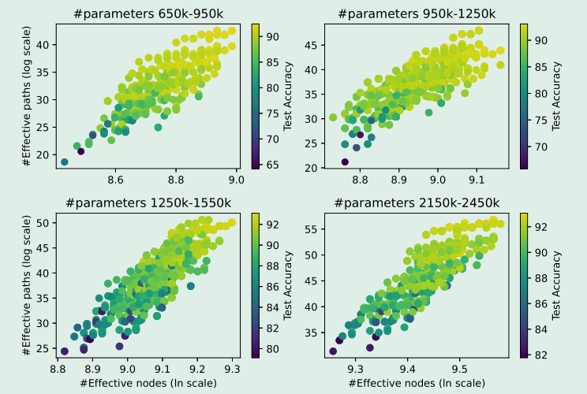

通过 NAS 实验，作者指出，一般来说，具有更多有效节点数和有效路径数的网络，表现更好。

---

## 4. NPB

作者认为在剪枝时平衡有效节点数量和有效路径数量会有更好的表现，即解以下的优化问题：

$$\begin{aligned}\text{Maximize}&\quad\alpha f_n+(1-\alpha)f_p\\s.t&\quad\|\mathbf{M}\|_1\leq N(1-s)\end{aligned}$$

其中 f_n 为有效节点数，f_p 为有效路径数，α 即平衡系数。

全局解这个优化问题是困难的，作者通过逐层设定（ERK）稀疏度，逐层地解这个优化问题。

用 h(l) 表示第 l 层的神经元数量，则第 l + 1 层第 j 个节点的路径数量可以表示为：

$$P(\nu_j^{(l+1)})=\sum_i^{h^{(l)}}m_{ij}^{(l)}P(\nu_i^{(l)})$$

第 l + 1 层 总的路径数量为：

$$f_p(m)=\sum_j^{h^{(l+1)}}P(\nu_j^{(l+1)})$$

第 l 层一个节点 v_i 被激活的条件可以表示为：

$$P(\nu_i^{(l)})\sum_j^{h^{(l+1)}}m_{ij}^{(l)}\geq1\Leftrightarrow\min(P(\nu_i^{(l)})\sum_j^{h^{(l+1)}}m_{ij}^{(l)};1)=1$$

第 l + 1 层一个节点 v_j 被激活的条件可以表示为：

$$\sum_i^{h^{(l)}}m_{ij}^{(l)}P(\nu_i^{(l)})\geq1\Leftrightarrow\min(\sum_i^{h^{(l)}}m_{ij}^{(l)}P(\nu_i^{(l)});1)=1$$

则在优化问题中有效节点数量可以表示为：

$$f_n(m)=\sum_i\min(P(\nu_i^{(l)})\sum_jm_{ij}^{(l)};1)+\sum_j^{h^{(l+1)}}\min(\sum_i^{h^{(l)}}m_{ij}^{(l)}P(\nu_i^{(l)});1)$$

对于卷积层，m_ij 的取值范围为 0 到 kernel_size**2。

最后增加一个正则项，其作用在于，期望卷积层中不同 2D 核都能至少保有一个连接：

$$R=\sum_i\sum_jmin(m_{ij}^{(l)}-1;0)$$

则最终的目标函数为：

$$\begin{aligned}\mathrm{Maximize}&\alpha f_{n}+(1-\alpha)f_{p}+\beta R\\s.t&\|\mathbf{m}^{(l)}\|_{1}\leq N^{(l)}(1-s^{(l)})\end{aligned}$$

为了统一度量，上述有效数量均采用对应层相应的最大值来归一化，同时考虑到优化有效节点数量比路径数量更容易，选择一个较小的 α。

α = 0 . 01 and β = 1。

优化伪代码见附录 C，算法：

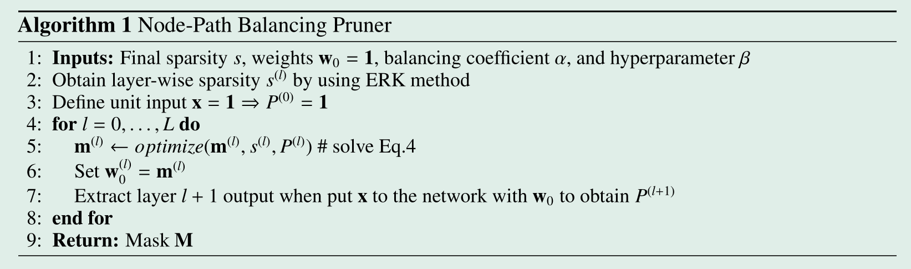

---

## 5 评估

### Code

由于本人不太明白如何解论文中所述的优化问题，所以代码 copy 的作者的开源代码。
主要工作就是将代码全部整合到 NPBPruner，优化一下逻辑（代码中一些迷惑操作，获取中间层输入，再次确认失效连接等），在不使用掩码层的前提下实现一致的效果。

不得不说，源代码中的 trick 还真不少啊。

整个 pruner 框架如下，intermediate_inputs 用于 hook 时保存中间层输入，alpha, beta 即超参，chunk_size 是作者使用的一个 trick，
scale_weight 即通过某种方法初始化权重，而不是全部为 1，默认不使用，
node_constraint 是用于优化算法的约束条件，为 True 时约束各输入节点和输出节点所保留的连接数也满足稀疏度要求，默认 False。

get_layer_wise_sparsity, fine_tune_mask, optimize_layerwise 参见 
[ERK_sparsify](https://github.com/pvh1602/NPB/blob/main/Pruners/utils.py),
[fine_tune_mask](https://github.com/pvh1602/NPB/blob/main/Pruners/utils.py).
[optimize_layerwise](https://github.com/pvh1602/NPB/blob/main/Pruners/utils.py)。

optimization 参见 [Optimization_Pruner.optimization](https://github.com/pvh1602/NPB/blob/main/Pruners/pruners.py#L338)。

```python
class NPBPruner:
    def __init__(self, final_s, alpha=0.01, beta=1,
                 max_param_per_kernel=None, min_param_to_node=None,
                 chunk_size=32, is_scale_weight=False, scale_weight=None,
                 node_constraint=False):
        self.final_s = final_s
        self.weight_num = 0
        self.masks = {}
        self.parameters = {}
        self.intermediate_inputs = {}

        self.alpha = alpha
        self.beta = beta
        self.chunk_size = chunk_size
        self.is_scale_weight = is_scale_weight
        self.scale_weight = scale_weight
        self.node_constraint = node_constraint
        self.max_param_per_kernel = max_param_per_kernel  # 2D 核最多保留的连接数
        self.min_param_to_node = min_param_to_node  # 节点的最小连接数

    def init_parameters(self):
        for _, weight in self.parameters.items():
            weight.data.fill_(1.)

    def get_layer_wise_sparsity(self)

    def check_layer_ineff_param(self)

    def fine_tune_mask(self, net, input_shape)

    @staticmethod
    def optimize_layerwise(mask, inp, sparsity, alpha=0.7,
                           beta=0.001, max_param_per_kernel=None,
                           min_param_to_node=None,
                           init_weight=None,
                           node_constraint=False)

    # https://github.com/pvh1602/NPB/blob/main/Pruners/pruners.py
    def optimization(self, data_iter, net, device)

    @staticmethod
    def apply_mask(module, mask)

    def prune(self, net, T, size, batch_size, metric=False)
```

首先是 prune, 比较常规，记录 net_copy 的权重以及 mask，优化结束后将 mask 应用于原网络。
值得注意的是，优化过程是逐层进行的，需要记录每个层的输入，这里使用 hook 来保存中间输入。

```python
    def prune(self, net, T, size, batch_size, metric=False):
        def register_forward_hook(module, name):  # hook 每层的输入
            def hook_fn(module, input, output):
                self.intermediate_inputs[name] = input[0].data.cpu()
            module.register_forward_hook(hook_fn)

        device = next(net.parameters()).device

        net_copy = copy.deepcopy(net)
        net_copy.double()
        for name, module in net_copy.named_modules():
            if isinstance(module, nn.Linear) or isinstance(module, nn.Conv2d):
                module.weight.requires_grad = False
                self.masks[name] = torch.ones_like(module.weight, device=device)
                self.parameters[name] = module.weight
                self.weight_num += module.weight.numel()
                register_forward_hook(module, name)
            elif isinstance(module, nn.BatchNorm2d):
                nn.init.constant_(module.weight, 1)
                nn.init.constant_(module.bias, 0)

        data_iter = load_prune_data(size, batch_size, device)
        self.optimization(data_iter, net_copy, device)

        for name, module in net.named_modules():
            if isinstance(module, nn.Linear) or isinstance(module, nn.Conv2d):
                self.apply_mask(module, self.masks[name].float())

        del net_copy
        if metric:
            return compute_path_nodes(net, self.masks, data_iter)
```

optimization 里面有很多 trick，首先上来就是 is_resnet20 判定，这个如果是 nn.Sequential() 就直接掉了。

接下来初始化所有参数为1，并计算逐层的稀疏度，这里的 ERK 不懂，self.get_layer_wise_sparsity 就是直接照抄的。

接下来逐个读取 mask 来优化每一层的连接，这里首先需要重新跑一遍网络的前向来获取中间输入，注意随后优化完 mask 后需要拷贝到网络参数中，这样中间输入才正确。

这里有一个 trick，对于较大的卷积核，每次对 chunk_size 个输出通道进行优化，
（作者表示之所以这样做是因为直接优化如此大的一个卷积层太耗时了，另外就是理论上可以并行优化这若干组 chunk_size，参考附录 E）
而且 resnet20 对于较大的判定与 resnet18 不同，这也是为什么前面需要判定 resnet20。

对于残差连接，不设置 max_param_per_kernel（2D 核最多保留的连接数）、min_param_to_node，这是显而易见的。

还有一个 trick，每经过一个残差连接，max_param_per_kernel -= 2，这个不懂。

fc 处理和卷积层类似，较大的每次对 chunk_size 个输出通道进行优化。

最后还要一个针对 VGG 的 trick，vgg 从第二个块开始，在每个块最后一个卷积层开始优化前 max_param_per_kernel -= 2。

总的来说就是，对每个网络都有一个 trick。

```python
    def optimization(self, data_iter, net, device):
        data = next(iter(data_iter))
        input_dim = list(data.shape)
        input_dim[0] = 1
        input_ = torch.ones(input_dim).double().to(device)

        layer_id = 0
        estimate_time = 0
        is_resnet20 = False
        if net.__class__.__name__ == 'ResNet' and input_dim[2] == 32:
            is_resnet20 = True

        saved_params = {}
        i = 0
        for name in self.parameters.keys():
            if self.is_scale_weight:
                saved_params[name] = self.scale_weight[i]
            else:
                saved_params[name] = None
            i += 1

        net.eval()
        self.init_parameters()
        sparsity_dict = self.get_layer_wise_sparsity()
        for name, mask in self.masks.items():
            # 获取中间输入
            net(input_)
            prev = self.intermediate_inputs[name].detach().requires_grad_(False)
            if mask.dim() == 4:  # 卷积层
                if layer_id == 0:  # Input layer
                    c_out, c_in, kernel_size, _ = mask.shape
                    start_time = time.time()
                    new_mask = self.optimize_layerwise(mask, prev[0], sparsity=sparsity_dict[name],
                                                       alpha=self.alpha, beta=self.beta,
                                                       max_param_per_kernel=None,
                                                       init_weight=saved_params[name])
                    mask.copy_(new_mask)
                    estimate_time = estimate_time + time.time() - start_time
                else:
                    c_out, c_in, kernel_size, _ = mask.shape
                    # 较大的卷积核，每次对 chunk_size 个输出通道进行优化
                    if (c_out * c_in > 128 * 128) or (is_resnet20 and c_out * c_in > 64 * 32):  # Using Chunking
                        n_chunks = int(c_out / self.chunk_size)
                        new_mask = copy.deepcopy(mask)
                        # chunked_masks = []
                        for idx in range(n_chunks):
                            start_time = time.time()
                            start_c_out = idx * self.chunk_size
                            end_c_out = (idx + 1) * self.chunk_size
                            chunked_mask = copy.deepcopy(new_mask[start_c_out:end_c_out, :, :, :])
                            chunked_sparsity = sparsity_dict[name]
                            if self.is_scale_weight:
                                chunked_init_weight = saved_params[name][start_c_out:end_c_out, :, :, :]
                            else:
                                chunked_init_weight = None
                            if kernel_size == 1:  # 残差连接
                                chunked_mask = self.optimize_layerwise(chunked_mask, prev[0],
                                                                       sparsity=sparsity_dict[name],
                                                                       alpha=self.alpha,
                                                                       init_weight=chunked_init_weight,
                                                                       node_constraint=self.node_constraint)
                            else:
                                chunked_mask = self.optimize_layerwise(chunked_mask, prev[0], sparsity=chunked_sparsity,
                                                                       alpha=self.alpha, beta=self.beta,
                                                                       max_param_per_kernel=self.max_param_per_kernel,
                                                                       min_param_to_node=self.min_param_to_node,
                                                                       init_weight=chunked_init_weight,
                                                                       node_constraint=self.node_constraint)
                            mask[start_c_out:end_c_out, :, :, :].copy_(chunked_mask)
                            end_time = time.time()
                        estimate_time = estimate_time + end_time - start_time + 10  # 这里时间算的不对吧

                    else:  # small size
                        ...
                layer_id += 1
                if kernel_size == 1:  # 残差连接
                    if self.max_param_per_kernel > 5:
                        self.max_param_per_kernel -= 2

            elif mask.dim() == 2:  # Linear layer
                start_time = time.time()
                f_out, f_in = mask.shape
                if f_out * f_in > 512 * 10:
                    ...
                else:
                    print(prev.shape)
                    mask.copy_(self.optimize_layerwise(mask, prev[0], sparsity=sparsity_dict[name],
                                                       alpha=self.alpha, beta=0,
                                                       init_weight=saved_params[name]))
                layer_id += 1
                end_time = time.time()
                estimate_time = estimate_time + end_time - start_time

            # apply_mask
            self.parameters[name].data.copy_(mask)
            if net.__class__.__name__ == 'VGG':  # vgg 从第二个块开始，在每个块最后一个卷积层开始优化前 
                if layer_id in [3, 7, 11]:
                    print(True, c_in, c_out)
                    self.max_param_per_kernel -= 2

        self.fine_tune_mask(net, input_dim)
        # count_ineff_param(cloned_net, input_shape)
```

self.optimize_layerwise 调用 cvxpy 库实现凸优化，本人不熟悉该库的使用，基本就是全部 copy 过来，修改为静态函数。

完成所有层的优化后，最后还要微调 mask，这也是一个 tirck，目的在于处理高稀疏度下失效的连接（即经过优化后仍然连接着，但没有路径穿过的权重），
作者的实验中稀疏度 >= 96.84% 时它会起作用，增加路径数量。

首先让网络发生一次反向传播（网络参数已在前面优化中替换为对应的 mask），
梯度为 0 的连接即失效的连接（注意 * mask，作者源代码使用了掩码层，这里网络中的层都是不自带掩码的）。

逐层计算失效连接，对于失效的连接，首先在该层进行处理，如果处理后依然存在失效连接，则在下一层添加新的连接。

对于一个一般的卷积层，作者将失效的连接置为 0，并尝试建立新的连接，其优先补全具有更多有效连接的某对输出通道的输入通道，这样能获得更高的路径数。

fc 层失效的连接就只能失效了，因为一般其后不会有卷积层。

每次调整后，首先更新网络的参数，再进行一次反向传播计算调整后的失效数（注意每次清空梯度），将其放置到下一层建立连接。

```python
    def fine_tune_mask(self, net, input_shape):
        """将无效的连接断开，在当前层添加新的连接，并将剩余的无效连接数送至下一层以继续添加连接，一般在稀疏度（>=0.9684）较高时会起效。
        """
        X = torch.ones(input_shape).double()

        with torch.no_grad():  # 将复制的 net 中的权重 requires_grad 设定为 True
            for name, weight in self.parameters.items():
                weight.detach_()
                weight.requires_grad = True

        net = net.cpu().double()
        net.eval()
        y = net(X)
        term = torch.sum(y)
        term.backward()

        # 统计有效的连接
        eff_masks = {}
        for name, param in self.parameters.items():  # 乘上 mask，为 0 的连接 grad 也应该为 0
            eff_masks[name] = torch.where(param.grad.data != 0, 1, 0) * self.masks[name].to(torch.device("cpu"))
            param.grad.data.zero_()  # 清空梯度

        n_ineff_after = 0
        for name, mask in self.masks.items():
            if len(mask.shape) in [4]:
                c_out, c_in, k, w = mask.shape
                eff_mask = eff_masks[name]
                ineff_mask = mask - eff_mask.to(mask.device)  # 计算当前权重中失效的连接数
                n_ineff = ineff_mask.sum().item() + n_ineff_after  # 目前的总失效数（除去给与其它权重后重新激活的连接）
                if n_ineff > 1:
                    print(f'Adding ones to mask of layer {name}')
                    if k == 1:  # 残差连接
                        new_mask = eff_mask.view(c_out, c_in)
                        tmp = eff_mask.sum(dim=0).view(-1)  # 输入节点的有效连接数
                        idx = torch.argsort(tmp, descending=True)
                        count = 0
                        while n_ineff > 0:  # 优先补全连接了更多有效输出通道的输入通道
                            curr = new_mask[:, idx[count]].sum()
                            need = c_out - curr
                            n_ineff = n_ineff - need
                            new_mask[:, idx[count]].copy_(torch.ones_like(new_mask[:, idx[count]]))
                            count += 1
                    else:
                        new_mask = eff_mask.view(-1, k, w)
                        tmp = eff_mask.sum(dim=(2, 3)).view(-1)  # sum over kernels and
                        idx = torch.argsort(tmp, descending=True)  # sort in desceding order
                        count = 0
                        while n_ineff > 0:  # 优先补全具有更多有效连接的某对输出通道的输入通道
                            curr = new_mask[idx[count]].sum()
                            need = k * w - curr
                            n_ineff = n_ineff - need
                            new_mask[idx[count]].copy_(torch.ones_like(new_mask[idx[count]]))
                            count += 1
                    # 应用新 mask
                    new_mask = new_mask.view(c_out, c_in, k, w)
                    mask.data.copy_(new_mask)
                    with torch.no_grad():
                        self.parameters[name].copy_(mask)  # apply mask
                    # 再次确认是否存在无效连接
                    n_ineff_after, eff_mask = self.check_layer_ineff_param(net, input_shape, name)
                    mask.data.copy_(eff_mask)  # copy new mask
                    with torch.no_grad():
                        self.parameters[name].copy_(mask)  # apply mask
            elif len(mask.shape) in [2]:  # 设计的网络只要一层全连接，因此直接计算失效数即可，不补
                f_out, f_in = mask.shape
                eff_mask = eff_masks[name]
                ineff_mask = mask - eff_mask.to(mask.device)
                n_ineff = ineff_mask.sum().item() + n_ineff_after
                print(f'number of ineff params in {name} is {n_ineff}')
```

### 实验

论文实验结果如图

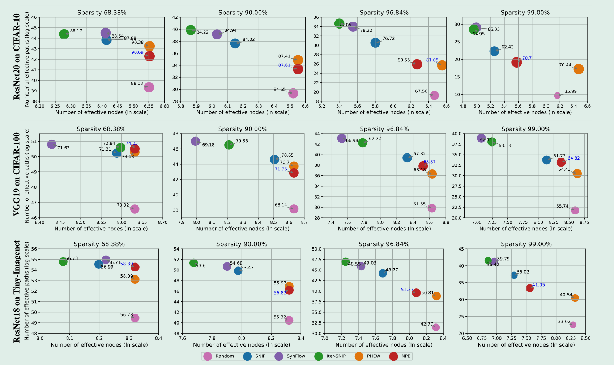

#### CIFAR-10

epoch, batch_size, lr = 160, 128, 0.1，优化算法为 SGD，momentum=0.9，weight_decay=1e-4， 

T = 20， 学习率衰减 10x at milestones=[80, 120]。

α = 0.01, β = 1, max_param_per_kernel=9, chunk_size=32。

网络结构：resnet20 第一个卷积层 kernel_size = 3，移除紧随其后的的最大池化层。

数据增强：RandomCrop(size=32, padding=4), RandomHorizontalFlip(), Normalize。

实验结果

```python
res20_npb = {"paths": [41.7295, 32.3180, 25.2882, 15.3190],
                     "nodes": [6.6187, 6.6187, 6.4019, 6.5468],
                     "accs": [90.04, 86.59, 80.06, 66.67]}
```

#### CIFAR-100

实验设定：

CIFAR-100: epoch, batch_size, lr = 160, 128, 0.1，优化算法为 SGD，momentum=0.9，weight_decay=1e-4， 

T = 100， 学习率衰减 10x at milestones=[60, 120]。

α = 0.01, β = 1, max_param_per_kernel=16, chunk_size=32。

网络结构：相比 vgg16 后 3 个 vgg 块多加一个卷积层。

数据增强：RandomCrop(size=32, padding=4), RandomHorizontalFlip(), Normalize。

实验结果

```python
vgg19_npb = {"paths": [49.6937, 42.5868, 36.2806, 36.1280],
                     "nodes": [8.6318, 8.6318, 8.5275, 8.1409],
                     "accs": [70.93, 68.96, 64.81, 57.28]}
```

#### tiny-ImageNet

实验设定：

tiny-ImageNet: epoch, batch_size, lr = 100, 128, 0.01，优化算法为 SGD，momentum=0.9，weight_decay=1e-4， 

T = 100， 学习率衰减 10x at milestones=[30, 60, 80]。

α = 0.01, β = 1, max_param_per_kernel=16, chunk_size=16。

网络结构：resnet18 第一个卷积层 kernel_size = 3，移除紧随其后的的最大池化层。

数据增强：RandomCrop(size=64, padding=4), RandomHorizontalFlip(), Normalize。

```python
res18_npb = {"paths": [52.4647, 44.3521, 37.8610, 36.0514 / 34.9934 / 35.7530],
                     "nodes": [8.4240, 8.4240, 8.0883, 7.2876 / 7.3877 / 7.1585],
                     "accs": [58.69, 56.81, 51.16, 39.09 / 40.05 / 40.29]}
```

### 源代码实验

ResNet20 数据基本吻合，在 99% 稀疏度的结果与论文差异较大。

VGG19 在所有稀疏度的结果与论文差异都较大。

ResNet18 在数据基本吻合，但在 99% 稀疏度的结果与论文有约 1 个百分点的差异。

尝试直接跑作者的源代码进行实验。

上来报 arg 没有 is_addin 参数，看了一下 main.py 解析命令行参数时确实没设置这个参数，这个参数为 False 时是常规的训练，
为 True 时会在训练的每个 epoch 以一定打乱 mask，并计算打乱前后的有效路径数量和有效节点数量。
添加该参数，设置默认值为 False 即可。

参数中 compression 表示压缩率，稀疏度为 1 - (1/10)**compression，取 compression 为 1 和 2 时稀疏度为 90% 和 99%。

实验数据记录如下

```python
NPB_o = {
    "90": {
        "res20": [1.9146067791061172e+32, 701, 87.23],
        "vgg": [1.8026721192587414e+43, 5607, 68.98]
    },
    "99": {
        "res20": [1138902552300079.2, 590, 65.72],
        "vgg": [4.183393121797471e+35, 1570, 57.22],
        "res18": [2.8862553321013666e+37, 1095, 42.92]
    }
}
```

#### resnet20

命令行参数如下

```python
python main.py --experiment singleshot --pruner npb --compression 1 
--init_mode ERK --alpha 0.01 --max_p 9 --beta 1 --model resnet20 
--model-class lottery --post-epoch 160 --optimizer momentum --dataset cifar10 --pre-epoch 0 --lr 0.1
```

90% (compression 1)运行结果

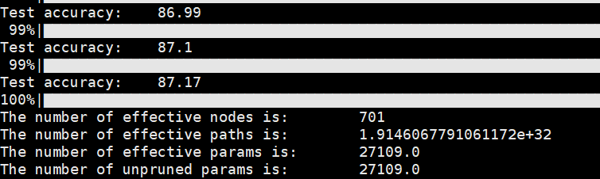

99% (compression 2)运行结果

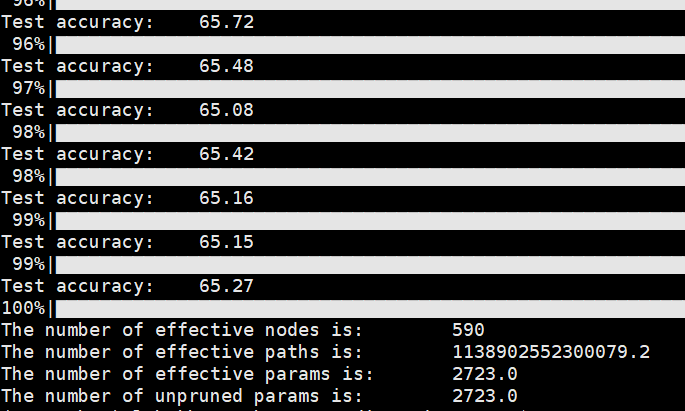

好像没什么问题的样子，在两个稀疏度上的表现与 copy 的代码一致。

#### vgg19

作者没给出参数，参考作者写的 cifar10 和 tiny-imagenet 指令，命令行参数如下

```python
python main.py --experiment singleshot --pruner npb --compression 1 
--init_mode ERK --alpha 0.01 --max_p 16 --beta 1 --model vgg16-bn
--model-class lottery --post-epoch 160 --optimizer momentum --dataset cifar100 --pre-epoch 0 --lr 0.1
```

90% (compression 1)运行结果

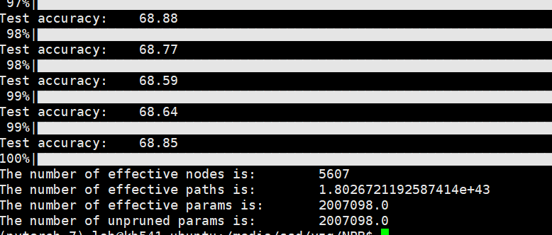

99% (compression 2)运行结果

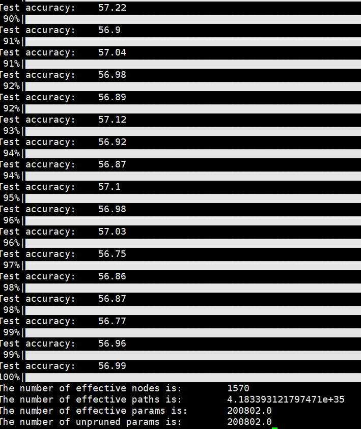

好像没什么问题的样子，在两个稀疏度上的表现与 copy 的代码一致，与作者论文数据差距有点大，可能实验参数有问题？

#### tiny-imagenet

命令行参数如下

```python
python main.py --experiment singleshot --pruner npb --compression 2 
--init_mode ERK --alpha 0.01 --chunk_size 16 --max_p 6 --beta 2 --model resnet18 
--model-class tinyimagenet --post-epoch 100 --optimizer momentum --dataset tiny-imagenet --pre-epoch 0 --lr 0.01
```

99% (compression 2)运行结果

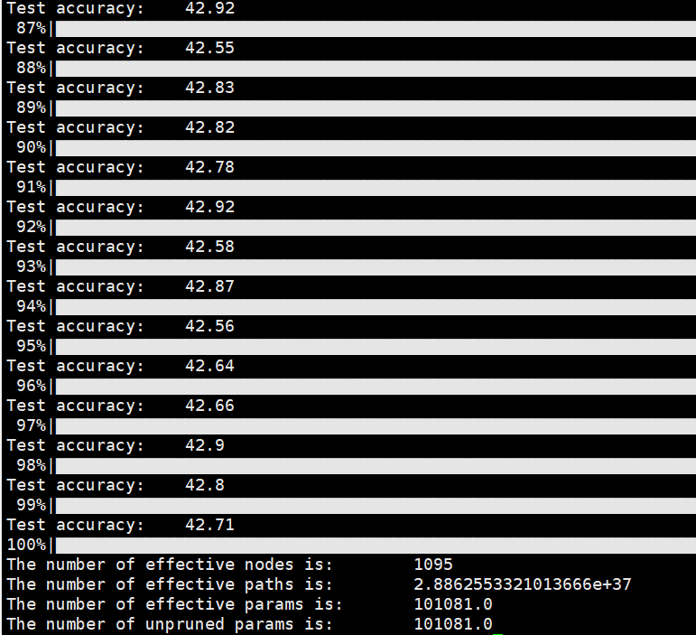

问题很大，居然比论文数据高将近两个点。

反复排查代码也没找到原因，比对各层的输入、凸优化结果（给定稀疏度，同样的输入，同样的层参数和mask，优化结果并不完全一样）
、fine_tune 对 mask 的调整等也没什么大问题，
期间发现作者将所有网络参数置为 1，包括 bias，卷积层不包含 bias，只有 BN 层和 fc 层包含，
推测主要对有效路径计算造成影响，实际实验似乎与原本没有太大区别。

最终发现指令参数似乎不包含 lr-drops，这意味着 cifar10 和 tiny-image 采样的学习率下降策略可能都是 Default 值。
经检查，该值为 [60, 120]，与原论文 [30, 60, 80] 不符合。

lr-drops 修改为该值后 (按照命令行的参数同时修改 beta=2)，copy 的代码最终精度达到 42.79%（path = 35.1873, node = 7.2284）。

同时，使用源代码执行以下命令

```python
python main.py --experiment singleshot --pruner npb --compression 2 
--init_mode ERK --alpha 0.01 --chunk_size 16 --max_p 6 --beta 2 --model resnet18 
--model-class tinyimagenet --post-epoch 100 --optimizer momentum --dataset tiny-imagenet --pre-epoch 0 --lr 0.01
--lr-drops 30 60 80
```

得到的结果如下：

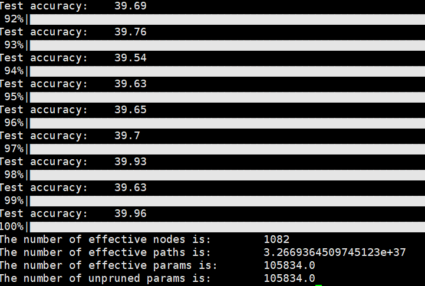

总的来说，源代码在 99% 稀疏度上的表现与 copy 的代码一致。

#### compute path and nodes

本人计算有效路径和有效节点数量的代码如下，原作者的代码见 [measure_node_path](https://github.com/pvh1602/NPB/blob/main/Utils/metrics.py)。

```python
def compute_path_nodes(net, masks, data_iter):
    net = copy.deepcopy(net)

    data = next(iter(data_iter))
    input_dim = list(data.shape)
    input_dim[0] = 1
    X = torch.ones(input_dim).double()

    parameters = {}
    with torch.no_grad():
        for name, module in net.named_modules():
            if isinstance(module, nn.Linear) or isinstance(module, nn.Conv2d):
                module.weight.requires_grad = True
                module.weight.data.copy_(masks[name])
                parameters[name] = module.weight

    net.eval()
    net.cpu().double()
    y = net(X)
    term = torch.sum(y)
    term.backward()

    paths = term.item()
    print(term, torch.log10(term))
    nodes = torch.sum(y > 0)
    cnt = y.shape[1]

    with torch.no_grad():
        for name, weight in parameters.items():
            if weight.dim() == 4:
                if weight.shape[2] == 1:
                    continue
                p = torch.sum(weight.grad, dim=[0, 2, 3])
            else:
                p = torch.sum(weight.grad, dim=0)
            nodes += torch.sum(p > 0)
            print(torch.sum(p > 0))
            cnt += p.shape[0]
            weight.data.fill_(1)
        y = net(X)

    print(nodes, torch.log(nodes))
    del net
    return (paths / torch.sum(y)).item(), (nodes / cnt).item()
```

上述代码计算的路径数一般少于作者代码计算的，其原因主要在于作者将网络中所有参数置为 1，包括 bias，众多 BN 层的 bias 置为 1 对路径数量有一定贡献。

上述代码计算的节点数一般多于作者代码计算的，部分原因在于重复计算节点（残差连接，上述代码已修正）。

### Pruning Time and FLOPs Reduction

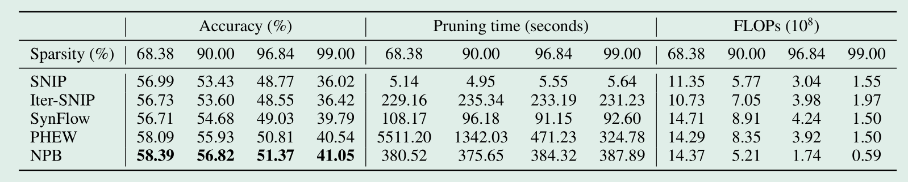

个人感觉 NPB 耗时还是比较长的，尤其是已经使用了 chunk 技巧，并且迭代剪枝算法全部设置 T = 100。

FLOP 意指浮点运算数，可以理解为计算量，用来衡量算法/模型的复杂度。这里大概是指 NPB 剪枝的网络计算量较小，在训练和推理上更有优势。

---

## 6. 总结

提出了一个新框架，从有效路径和有效节点的角度来描述前瞻性学习算法，洞悉这些算法背后的工作机制。

解释了逐层随机打乱 mask 依然有效的原因，以及在极高稀疏度下失效的原因。

从平衡有效节点和有效路径数量能提升性能出发，提出了 NPB 算法。

从剪枝后模型的有效路径和有效节点的数量，确实可以一定程度上预见表现效果，就是代码有点一言难尽。

